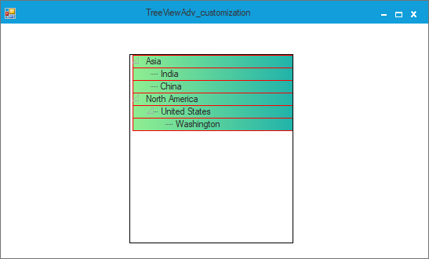

# How to separate background between two adjacent nodes in WinForms TreeViewAdv?

You can separate the background between two adjacent nodes in [WinForms TreeViewAdv](https://www.syncfusion.com/winforms-ui-controls/treeview) control by using [BeforeNodePaint](https://help.syncfusion.com/cr/windowsforms/Syncfusion.Windows.Forms.Tools.TreeViewAdv.html#Syncfusion_Windows_Forms_Tools_TreeViewAdv_BeforeNodePaint) event. Refer the below code for your reference.

**C#**

```csharp
treeViewAdv1.BeforeNodePaint += TreeViewAdv1_BeforeNodePaint1;
 
//Customize Background of Nodes
private void TreeViewAdv1_BeforeNodePaint1(object sender, TreeNodeAdvPaintEventArgs e)
{
   LinearGradientBrush lBrush = new LinearGradientBrush(e.Node.Bounds, Color.LightGreen, Color.LightSeaGreen, LinearGradientMode.Horizontal);
   e.Graphics.FillRectangle(lBrush, e.Node.Bounds);
   e.Graphics.DrawRectangle(new Pen(Color.Red), e.Node.Bounds);
}
```

**VB.Net**
```vbnet
AddHandler treeViewAdv1.BeforeNodePaint, AddressOf TreeViewAdv1_BeforeNodePaint1

'Customize Background of Nodes
Private Sub TreeViewAdv1_BeforeNodePaint1(ByVal sender As Object, ByVal e As TreeNodeAdvPaintEventArgs)
    Dim lBrush As New LinearGradientBrush(e.Node.Bounds, Color.LightGreen, Color.LightSeaGreen, LinearGradientMode.Horizontal)
    e.Graphics.FillRectangle(lBrush, e.Node.Bounds)
    e.Graphics.DrawRectangle(New Pen(Color.Red), e.Node.Bounds)
End Sub
```


